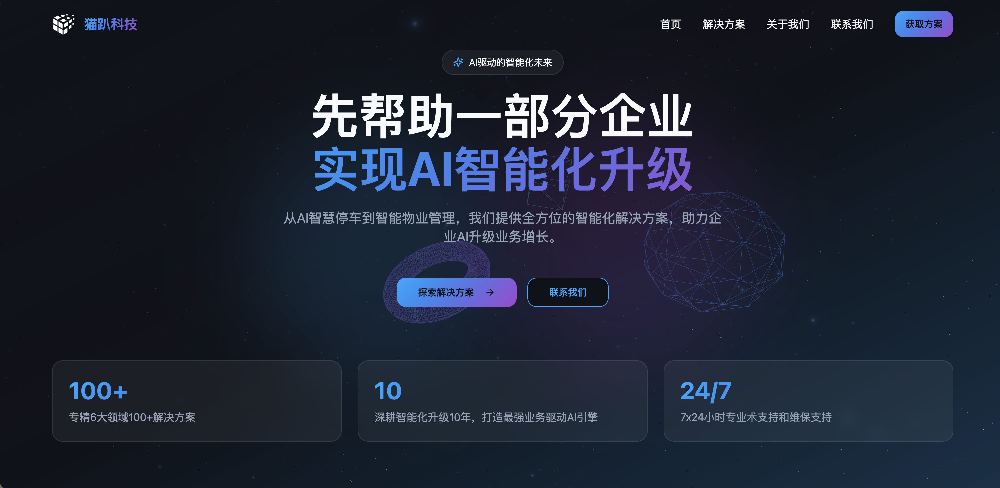

# 3D official website react template

> AI驱动的智能化解决方案平台官网模版， 【猫趴科技】官网代码开源；

现代化企业官网模版，企业级智能化解决方案展示平台，shadcn+Three+Vite+React+Framer Motio企业官网模版



- 预览：[猫趴科技官网](https://catparty.cn)

## ✨ 特性

- 🎨 **现代化UI设计** - 基于 Shadcn UI 组件库，提供美观且一致的用户界面
- 🎭 **3D动画背景** - 使用 React Three Fiber 打造沉浸式的3D视觉效果
- 🎬 **流畅动画** - Framer Motion 驱动的页面过渡和交互动画
- 📱 **响应式设计** - 完美适配桌面端、平板和移动设备
- ⚡ **高性能** - Vite 构建工具，快速开发和构建
- 🚀 **云端部署** - 支持 Cloudflare Workers/Pages 一键部署
- 🎯 **TypeScript** - 完整的类型安全支持

## 🛠️ 技术栈

### 核心框架
- **React 18** - 现代化的UI框架
- **TypeScript** - 类型安全的JavaScript
- **Vite** - 下一代前端构建工具

### UI组件库
- **Shadcn UI** - 基于 Radix UI 的高质量组件库
- **Tailwind CSS** - 实用优先的CSS框架
- **Framer Motion** - 强大的动画库
- **Lucide React** - 精美的图标库

### 3D图形
- **React Three Fiber** - React的Three.js渲染器
- **@react-three/drei** - 有用的Three.js辅助工具
- **Three.js** - 3D图形库

### 路由与状态管理
- **React Router** - 声明式路由
- **TanStack Query** - 强大的数据同步库

### 部署
- **Cloudflare Workers** - 边缘计算平台
- **Wrangler** - Cloudflare Workers CLI工具

## 📦 项目结构

```
intellipark-solutions/
├── public/                 # 静态资源文件
├── src/
│   ├── components/         # React组件
│   │   ├── ui/            # Shadcn UI组件
│   │   ├── Hero.tsx       # 首页Hero区域
│   │   ├── Hero3DBackground.tsx  # 3D背景组件
│   │   ├── Navbar.tsx     # 导航栏
│   │   ├── Solutions.tsx  # 解决方案展示
│   │   ├── Features.tsx   # 功能特性
│   │   ├── CTA.tsx        # 行动号召
│   │   └── Footer.tsx     # 页脚
│   ├── pages/             # 页面组件
│   │   ├── Index.tsx      # 首页
│   │   ├── Solutions.tsx  # 解决方案页面
│   │   ├── About.tsx      # 关于我们
│   │   ├── Contact.tsx    # 联系我们
│   │   └── NotFound.tsx   # 404页面
│   ├── data/              # 数据文件
│   ├── hooks/             # 自定义Hooks
│   ├── lib/               # 工具函数
│   ├── App.tsx            # 应用入口
│   └── main.tsx           # 应用启动文件
├── worker/                # Cloudflare Worker
├── vite.config.ts         # Vite配置
├── tailwind.config.ts     # Tailwind配置
└── wrangler.toml          # Cloudflare Workers配置
```

## 🚀 快速开始

### 环境要求

- Node.js >= 18.0.0
- npm >= 9.0.0 或 yarn >= 1.22.0

### 安装依赖

```bash
npm install
```

### 开发模式

启动开发服务器：

```bash
npm run dev
```

应用将在 `http://localhost:8080` 启动。

### 构建生产版本

```bash
npm run build
```

构建产物将输出到 `dist/` 目录。

### 预览生产构建

```bash
npm run preview
```

### Worker开发

启动 Cloudflare Worker 开发服务器：

```bash
npm run worker:dev
```

## 📝 可用脚本

| 脚本 | 描述 |
|------|------|
| `npm run dev` | 启动开发服务器 |
| `npm run build` | 构建生产版本 |
| `npm run build:dev` | 构建开发版本 |
| `npm run preview` | 预览生产构建 |
| `npm run lint` | 运行ESLint检查 |
| `npm run deploy` | 构建并部署到生产环境 |
| `npm run deploy:preview` | 构建并部署到预览环境 |
| `npm run worker:dev` | 启动Worker开发服务器 |
| `npm run worker:deploy` | 部署Worker |

## 🌐 部署

### Cloudflare Workers/Pages

项目配置为使用 Cloudflare Workers 进行部署。

1. **安装 Wrangler CLI**（如果尚未安装）：
   ```bash
   npm install -g wrangler
   ```

2. **登录 Cloudflare**：
   ```bash
   wrangler login
   ```

3. **部署到生产环境**：
   ```bash
   npm run deploy
   ```

4. **部署到预览环境**：
   ```bash
   npm run deploy:preview
   ```

### 环境变量

复制 `.dev.vars.example` 为 `.dev.vars` 并填入实际的环境变量值：

```bash
cp .dev.vars.example .dev.vars
```

`.dev.vars` 文件已添加到 `.gitignore`，不会被提交到版本控制。

## 🎯 核心解决方案

### 1. AI智慧停车
智能车位识别、自动计费、无感支付，打造高效停车体验。

### 2. AI智能体定制
教育、医疗领域AI助手，提供个性化智能服务解决方案。

### 3. 智慧门禁通行
人脸识别、权限管理、访客系统，构建安全通行环境。

### 4. 智慧物业解决方案
维保、通行、安防、工单、资产管理一体化平台。

### 5. 宠物领域AI解决方案
宠物行业APP、物联网产品定制、智能控制、AI分析。

### 6. IVM行业视频管理
智能监控、视频分析、事件预警，保障安全运营。

## 📄 页面路由

- `/` - 首页
- `/solutions` - 解决方案页面
- `/about` - 关于我们
- `/contact` - 联系我们
- `*` - 404页面

## 🎨 自定义配置

### Tailwind CSS

编辑 `tailwind.config.ts` 来自定义主题颜色、字体等样式配置。

### Vite

编辑 `vite.config.ts` 来配置构建选项、插件等。

### Cloudflare Workers

编辑 `wrangler.toml` 来配置部署环境、域名等。

## 📚 开发指南

### 添加新组件

1. 在 `src/components/` 目录下创建新的组件文件
2. 使用 TypeScript 编写组件
3. 遵循项目的代码风格和命名规范

### 添加新页面

1. 在 `src/pages/` 目录下创建新的页面组件
2. 在 `src/App.tsx` 中添加路由配置

### 使用UI组件

项目使用 Shadcn UI 组件库，所有组件位于 `src/components/ui/` 目录。可以直接使用或根据需求自定义。

## 🤝 贡献

欢迎提交 Issue 和 Pull Request！

## 📧 联系我们

- **电话**: 0755-32867416 / 13822770125
- **邮箱**: sales@catparty.cn
- **地址**: 中国·深圳市

## 📄 许可证

本项目为私有项目。

---

**Intellipark Solutions** - 助力企业AI智能化升级 🚀
